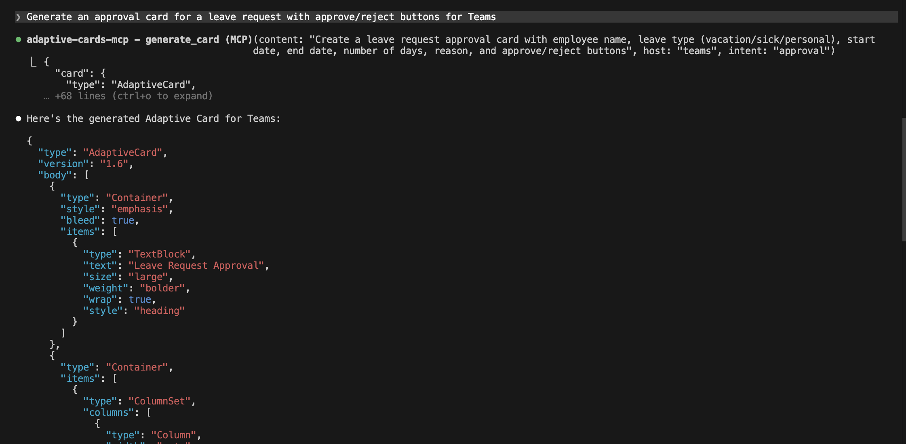

# adaptive-cards-ai-vscode

AI-powered Adaptive Card generation, preview, and validation inside VS Code.

<p align="center">
  
</p>

> **Blog:** [I Built an MCP Server That Makes AI 10x Better at Adaptive Cards](https://singhvikrant.substack.com/p/i-built-an-mcp-server-that-makes)
>
> Part of the [Adaptive Cards MCP](https://github.com/VikrantSingh01/adaptive-cards-mcp) ecosystem.
> Also available as an [MCP server](https://github.com/VikrantSingh01/adaptive-cards-mcp) (7 tools, 862 tests, 21 patterns) and [browser extension](https://github.com/VikrantSingh01/adaptive-cards-ai-designer).

## Features

- **Generate Card** (`Ctrl+Shift+A` / `Cmd+Shift+A`) — describe a card in natural language, select host and intent, get valid JSON
- **Embedded Designer** — split-view card designer with live preview + JSON editor + element palette
- **Form Factor Preview** — Desktop, Tablet, Mobile, and Narrow width modes
- **Preview** — rendered card in a side panel using the official Adaptive Cards JS renderer
- **Validate** — real v1.6 schema validation (3,297-line official schema), accessibility scoring (0-100), host compatibility checks for 6 hosts
- **Optimize** — auto-fix accessibility, modernize actions, upgrade version
- **Data to Card** — select JSON/CSV data, convert to optimal card (Table, FactSet, Chart, List)
- **CodeLens** — Preview / Validate / Optimize buttons on `.card.json` files
- **Snippets** — 11 code snippets for common card elements
- **AI Providers** — optional Copilot, Claude, or OpenAI integration (configurable in settings)
- **Right-click menu** — generate from selection, convert data from selection

**Live card generation:**

<p align="center">
  
</p>

## Installation

### From Source

```bash
git clone https://github.com/VikrantSingh01/adaptive-cards-ai-vscode.git
cd adaptive-cards-ai-vscode
npm install
npm run compile
```

Then open the folder in VS Code and press **F5** to launch the Extension Development Host.

### From Monorepo

```bash
git clone https://github.com/VikrantSingh01/adaptive-cards-mcp.git
cd adaptive-cards-mcp/packages/vscode-extension
npm install
npm run compile
```

### From VSIX

```bash
npm run package
code --install-extension adaptive-cards-ai-vscode-1.0.0.vsix
```

## Commands

| Command | Shortcut | Description |
|---------|----------|-------------|
| Generate Card | `Ctrl+Shift+A` / `Cmd+Shift+A` | AI-powered card generation from natural language |
| Open Designer | — | Embedded designer with live preview, JSON editor, element palette |
| Preview Card | — | Render card in side panel with host config switcher |
| Validate Card | — | Full diagnostics (v1.6 schema, accessibility, host compat) |
| Optimize Card | — | Auto-fix accessibility and modernize best practices |
| Data to Card | — | Convert selected JSON/CSV to optimal card |

## AI Provider Settings

| Setting | Options | Default |
|---------|---------|---------|
| `adaptiveCards.aiProvider` | `none`, `copilot`, `anthropic`, `openai` | `none` |
| `adaptiveCards.anthropicApiKey` | Your API key | — |
| `adaptiveCards.openaiApiKey` | Your API key | — |

`none` = fast deterministic pattern matching (no API calls). Other providers augment generation with LLM creativity.

## Snippets

Type any prefix in a `.json` file:

| Prefix | Description |
|--------|-------------|
| `ac-card` | Full Adaptive Card v1.6 skeleton |
| `ac-textblock` | TextBlock element |
| `ac-image` | Image with altText |
| `ac-columnset` | ColumnSet with 2 columns |
| `ac-factset` | FactSet |
| `ac-table` | Table with headers |
| `ac-input-text` | Input.Text with label |
| `ac-input-choice` | Input.ChoiceSet |
| `ac-action-execute` | Action.Execute (Universal Actions) |
| `ac-action-openurl` | Action.OpenUrl |
| `ac-container` | Container |

## Powered By

This extension uses [adaptive-cards-mcp](https://github.com/VikrantSingh01/adaptive-cards-mcp) v2.0.0 as its core engine:

- Official v1.6 JSON Schema (3,297 lines) with ajv validation
- 21 production-ready layout patterns
- 36 curated example cards
- 6 host profiles (Teams, Outlook, Webchat, Windows, Viva, Webex)
- Smart host adaptation (Table to ColumnSet, Carousel to Container, etc.)
- Accessibility checker with WCAG scoring

## Related

- [Adaptive Cards MCP](https://github.com/VikrantSingh01/adaptive-cards-mcp) — MCP server + core library (7 tools, 862 tests)
- [Adaptive Cards AI Designer](https://github.com/VikrantSingh01/adaptive-cards-ai-designer) — Chrome/Edge extension for the AC Designer
- [Adaptive Cards Documentation](https://adaptivecards.io/) — Official docs and Designer

## License

MIT
